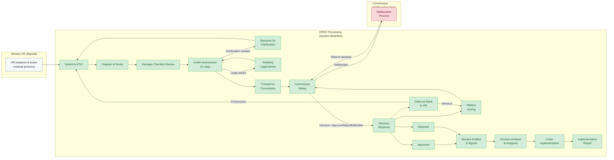

```mermaid
flowchart LR
    %% Ministry HR (Manual steps only)
    subgraph MinistryHR["Ministry HR (Manual)"]
        direction TB
        HR_Prepare["HR prepares & scans<br/>(manual process)"]
    end
    
    %% OPSC Processing (End-to-end system workflow)
    subgraph OPSC["OPSC Processing<br/>(System Workflow)"]
        direction TB
        SUB["Submit to PSC"] --> REG["Register & Route"]
        REG --> MCR["Manager Checklist Review"]
        MCR --> UA["Under Assessment<br/>(21-day)"]
        
        %% Assessment handling
        UA -->|Clarification needed| RFC["Returned for<br>Clarification"]
        RFC --> SUB
        UA -->|Legal advice| ALA["Awaiting<br>Legal Advice"]
        ALA --> UA
        
        %% Commission interaction
        UA --> FTC["Forward to<br>Commission"]
        FTC --> CS["Commission<br>Sitting"]
        
        %% Commission sends decision back
        CS -->|Decision:&nbsp;Approve/Reject/Defer/MA| DECISION["Decision<br>Received"]
        DECISION --> APP["Approved"]
        DECISION --> REJ["Rejected"]
        DECISION --> MA["Matters<br>Arising"]
        DECISION --> DHR["Deferred Back<br>to HR"]
        
        %% Deferral handling
        DHR -->|Full process| SUB
        DHR -->|Shortcut| MA
        MA --> CS
        
        %% Post-decision processing (OPSC handled)
        APP --> MDS["Minutes Drafted<br>& Signed"]
        REJ --> MDS
        MDS --> DEA["Decision Entered<br>& Assigned"]
        DEA --> UI["Under<br>Implementation"]
        UI --> IR["Implementation<br>Report"]
    end
    
    %% Commission (Deliberation and decision only)
    subgraph Commission["Commission<br/>(Deliberation Only)"]
        direction TB
        CS -->|Deliberates| DELIB[Deliberation<br>Process]
        DELIB -->|Returns decision| CS
    end
    
    %% Connect manual HR to system start
    HR_Prepare --> SUB
    
    %% Styling
    classDef ministryHR fill:#f8f9fa,stroke:#6c757d,color:#212529;
    classDef opsc fill:#d4edda,stroke:#28a745,color:#155724;
    classDef commission fill:#f8d7da,stroke:#dc3545,color:#721c24;
    
    class HR_Prepare ministryHR;
    class SUB,REG,MCR,UA,RFC,ALA,FTC,CS,DECISION,APP,REJ,MA,DHR,MDS,DEA,UI,IR opsc;
    class DELIB commission;
```