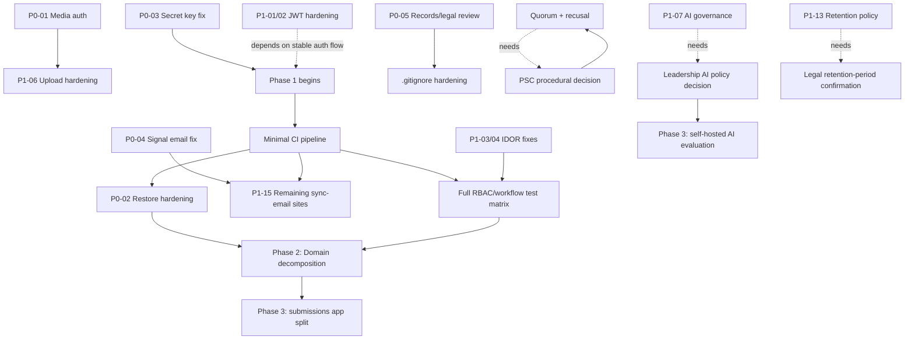

# Enhancement Roadmap

Phased per the audit brief. Each item: outcome, effort, dependencies, owner role, success measure.

---

## Phase 0 — Pre-production blockers (target: 2-3 weeks)

| Item | Outcome | Effort | Depends on | Owner | Success measure |
|---|---|---|---|---|---|
| P0-01: Authenticate media serving | Documents no longer downloadable without RBAC re-check | M | — | Backend lead | A request to any `/media/*` URL without a valid, in-scope session returns 401/403, verified by a new automated test |
| P0-02: Harden backup restore | Restore requires checksum match or is moved out-of-band | M | — | Backend lead | Uploading an arbitrary/unsigned file to `/backup/restore/` is rejected |
| P0-03: Remove hardcoded `SECRET_KEY` fallback | App fails to start (loudly, in a controlled way) if `DJANGO_SECRET_KEY` is unset | S | Confirm prod `.env` already sets it (Open Question) | Backend lead | Code review confirms no literal fallback remains |
| P0-04: Move automation-engine notifications off the request thread | Signal-triggered emails no longer run inside an open DB transaction | M | — | Backend lead | Load test / code review confirms `signals.py`'s email path uses `on_commit` + Celery |
| P0-05: Records/legal review of tracked sensitive files | A documented decision on history-purge vs. accept-and-restructure | S (review) | Legal/records input | IPDU Manager + legal | A written decision on file, `.gitignore` updated to prevent recurrence regardless of the purge decision |

## Phase 1 — 0-3 months

| Item | Outcome | Effort | Depends on | Owner | Success measure |
|---|---|---|---|---|---|
| P1-01/02: JWT storage hardening | Tokens moved to httpOnly cookies + CSRF | L | Phase 0 stable | Backend + frontend leads | XSS no longer directly exfiltrates session |
| P1-03/04: Close checklist & SLA-endpoint IDORs | Cross-unit/cross-ministry data access closed | M | — | Backend lead | New RBAC test suite (below) passes |
| P1-05: Session invalidation on password change | Stolen tokens die when a compromised account's password is changed | S | — | Backend lead | Test: old token 401s post-change |
| P1-06: File upload hardening | Content-sniffing + malware scan ahead of the AI queue | L | P0-01 (storage location) | Backend lead | Test suite includes a malicious-file-rejection case |
| P1-07: AI data governance | Redaction + opt-in + payload-hash audit trail | L (near-term) / XL (self-hosted alternative) | Leadership policy decision (Open Questions) | IPDU Manager + backend lead | `AIGenerationLog` captures a verifiable record of what was sent |
| P1-08: Audit log tamper-evidence | Hash-chained, DB-grant-protected audit table | L | — | Backend lead | Independent verification command exists and passes |
| P1-09/10: RBAC model coherence | Role Definitions screen either wired to real enforcement or clearly scoped | L | — | Backend lead | Documentation matches actual enforcement, or enforcement matches the tool |
| P1-11: Form draft persistence | No data loss on session expiry mid-form | M | — | Frontend lead | Manual test: kill network mid-form, refresh, data recovers |
| P1-12: Signature/annotation accessibility baseline | Screen-reader users can perceive and use the flow | L | — | Frontend lead | WCAG 1.1.1/4.1.2 pass for this component |
| P1-13: Schedule the retention purge; scope a real policy | Retention actually runs; category-aware schedule designed | M (schedule) / L (policy engine) | Legal confirmation of retention periods (Open Questions) | Backend lead + records/legal | Purge runs on schedule, logs its own action |
| P1-15: Close remaining sync-email call sites | No request-path outbound email left | L | P0-04 | Backend lead | Guardrail test (below) passes for all identified sites |
| P1-16: Minimal CI + backend test gate | Nothing merges without lint + test pass | XL (frontend test infra) / M (backend CI only, faster win) | — | Both leads | CI badge on every PR |
| Stand up minimal CI pipeline | Lint + test + `pip-audit`/`npm audit` on every push | M | — | DevOps/backend lead | Pipeline green on `main` |
| Quorum + recusal fields | Sittings/Flying Minutes record attendance and conflicts | L | PSC procedural confirmation (Open Questions) | Backend lead + PSC Secretary | New fields populated on every sitting going forward |

## Phase 2 — 3-9 months

| Item | Outcome | Effort | Depends on | Owner |
|---|---|---|---|---|
| Domain-modular decomposition, phases 1-3 (knowledge, odu_ipdu, audit/security) | Reduced merge contention on the 3 largest files | XL | Phase 1 CI in place | Backend lead |
| Full RBAC/workflow-transition test matrix | Every role × stage combination covered, positive and negative | L | — | Backend lead |
| Structured return-for-clarification | Field/document-level flagging, resubmission diff | L | — | Backend + frontend leads |
| Full SLA coverage across the Commission-sitting pipeline | Stage-ageing report for every stage, not just checklist/assessment | M | — | Backend lead |
| Notification deep-linking pass | Every notification links to the exact record | S-M | — | Backend lead |
| Component-reuse refactor (3 flagship list views) | Single source of truth for tables/badges/spinners | M | — | Frontend lead |
| i18n completeness sweep (Security admin, ODU checklist) | Full FR/Bislama coverage on remaining surfaces | M | — | Frontend lead |
| Request-timing middleware + correlation IDs | Small ops team can trace one request's log lines | M | — | Backend lead |
| Form builder maturity (conditional logic, versioned schemas) | Safer, richer form authoring; old responses stay interpretable against their original schema | L | — | Backend lead |
| Signed/expiring document URLs (superseding the P0-01 interim fix if storage moves off local disk) | Stronger long-term document-access model | M | P0-01 | Backend lead |

## Phase 3 — Strategic (9+ months)

| Item | Outcome | Effort | Depends on |
|---|---|---|---|
| Offline-tolerant capture (PWA) for outer-island ministries | Queued submissions, conflict resolution, sync-state UI | XL | Phase 1-2 stability |
| `submissions` app split (final, highest-risk decomposition phase) | Core domain isolated | XL | All prior decomposition phases proven |
| Declarative workflow configuration with simulation mode | PSC can amend SOP-driven transitions without a code release, safely | XL | Governance model resolved (ADR) |
| Cryptographic signature path (PAdES/TSA), contingent on legal recognition | Genuine non-repudiation | XL | Vanuatu digital-signature legislation |
| Self-hosted AI model for highest-sensitivity features | Removes the cross-border transfer question for discipline-adjacent drafting | XL | Leadership policy + budget decision |
| HRIS/payroll and government SSO integration | Reduced duplicate data entry, single identity | XL | External stakeholder coordination |
| Precedent search across decisions/minutes | "Has the Commission decided a similar matter before?" | L | Full-text search infrastructure (Postgres `tsvector`) |

---

## Dependency / sequencing diagram

