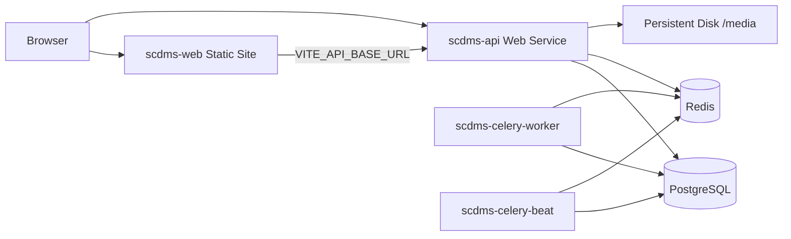

# Deploying on Render.com

This guide deploys the Commission Decision App as separate Render services: **PostgreSQL**, **Redis (Key Value)**, **Django API** (Docker + Gunicorn), **Celery worker**, **Celery beat**, and a **static React** frontend.

## Architecture



## Prerequisites

1. [Render](https://render.com) account and a **GitHub** (or GitLab) repo with this project pushed.
2. **Anthropic API key** for AI features (executive brief, staff chatbot).
3. **SMTP** credentials for password-reset and notification email (or use a provider such as SendGrid, Mailgun, Resend).

## Quick deploy (Blueprint)

1. In Render: **New → Blueprint**.
2. Connect the repository and select **`render.yaml`** at the repo root.
3. When prompted, fill **sync: false** variables (see table below).
4. Click **Apply**. First deploy may take 10–15 minutes.

After deploy, note the public URLs:

| Service       | Example URL                              |
|---------------|------------------------------------------|
| API           | `https://scdms-api.onrender.com`         |
| Frontend      | `https://scdms-web.onrender.com`         |

## Required environment variables

Set these on **`scdms-api`** (and ensure **`scdms-web`** has the frontend URL).

| Variable | Service | Example |
|----------|---------|---------|
| `DJANGO_ALLOWED_HOSTS` | scdms-api | `scdms-api.onrender.com` |
| `CORS_ALLOWED_ORIGINS` | scdms-api | `https://scdms-web.onrender.com` |
| `FRONTEND_URL` | scdms-api | `https://scdms-web.onrender.com` |
| `CDP_BASE_URL` | scdms-api | `https://scdms-api.onrender.com` |
| `VITE_API_BASE_URL` | scdms-web | `https://scdms-api.onrender.com/api` |
| `ANTHROPIC_API_KEY` | scdms-api | `sk-ant-...` |
| `SMTP_HOST`, `SMTP_USER`, `SMTP_PASSWORD` | scdms-api | your mail provider |
| `DEFAULT_FROM_EMAIL` | scdms-api | `SCDMS <noreply@yourdomain.com>` |

`DJANGO_SECRET_KEY` is auto-generated by the blueprint. Celery services copy it from the API service.

### Optional

| Variable | Purpose |
|----------|---------|
| `AUTO_SEED=1` | Run `seed_tracker` on API startup (demo data only; turn off after first boot) |
| `GUNICORN_WORKERS` | Default `2` |
| `ENABLE_STAFF_CHATBOT` | `true` / `false` (default on in code) |

After changing **`VITE_API_BASE_URL`**, trigger a **manual redeploy** of `scdms-web` (static sites bake env at build time).

## Verify deployment

1. **Health**: open `https://<api-host>/health/` — `database` and `redis` should be `true`.
2. **API root**: `https://<api-host>/` returns JSON service info.
3. **Frontend**: open the static site URL, log in (create superuser below if needed).
4. **Celery**: in Render logs for `scdms-celery-worker`, confirm the worker starts without import errors.

## Create an admin user

Render **Shell** on `scdms-api` (paid plans) or a one-off job:

```bash
python manage.py createsuperuser
```

For a demo dataset once:

1. Set `AUTO_SEED=1` on `scdms-api`, deploy, then set back to `0`.

## Files added for Render

| File | Role |
|------|------|
| `render.yaml` | Blueprint (DB, Redis, API, workers, static site) |
| `backend/Dockerfile.render` | Production API image |
| `backend/docker-entrypoint-render.sh` | migrate, collectstatic, Gunicorn |
| `backend/config/settings.py` | `DATABASE_URL`, proxy SSL, WhiteNoise, `CDP_BASE_URL` media URLs |

Local Docker Compose is unchanged; use `docker compose` for development.

## Media uploads

Uploaded files are stored on a **10 GB persistent disk** mounted at `/var/scdms/media` on the API service (`SERVE_MEDIA=true`). The disk is **not shared** with Celery workers. Background tasks that read files from disk may fail on workers unless you add shared object storage (S3, etc.) later.

## Custom domain

1. Add custom domain on **scdms-web** and **scdms-api** in Render.
2. Update `DJANGO_ALLOWED_HOSTS`, `CORS_ALLOWED_ORIGINS`, `FRONTEND_URL`, `CDP_BASE_URL`, and rebuild **scdms-web** with updated `VITE_API_BASE_URL`.

## Costs and limits

- **Starter** plans avoid cold starts on the API; free tiers spin down after inactivity.
- PostgreSQL and Redis have separate monthly pricing on Render.
- Three Docker services (API + 2 workers) plus DB, Redis, and static site — budget accordingly.

## Troubleshooting

| Symptom | Check |
|---------|--------|
| 502 on API | Deploy logs; `migrate` errors; invalid `DATABASE_URL` |
| CORS errors in browser | `CORS_ALLOWED_ORIGINS` must exactly match frontend origin (scheme + host, no trailing slash) |
| Login works locally on Render but API 400 | `DJANGO_ALLOWED_HOSTS` must include API hostname |
| Brief stuck on “Generating…” | `scdms-celery-worker` running; `ANTHROPIC_API_KEY` set; worker logs |
| Broken images / uploads | `CDP_BASE_URL` set to public API URL; disk mounted on API |
| Admin has no CSS | `collectstatic` in deploy logs; `USE_WHITENOISE=true` |

## Manual deploy (without Blueprint)

You can create each service by hand using the same settings as `render.yaml`:

- **Web (Docker)**: context `backend`, Dockerfile `Dockerfile.render`, health `/health/`, disk at `/var/scdms/media`.
- **Worker**: same image, command `celery -A config worker -l info`.
- **Worker**: command `celery -A config beat -l info --scheduler django_celery_beat.schedulers:DatabaseScheduler`.
- **Static site**: root `frontend`, build `npm ci && npm run build`, publish `dist`, SPA rewrite to `/index.html`.

Link `DATABASE_URL` and Redis connection strings from managed instances in the Render dashboard.
