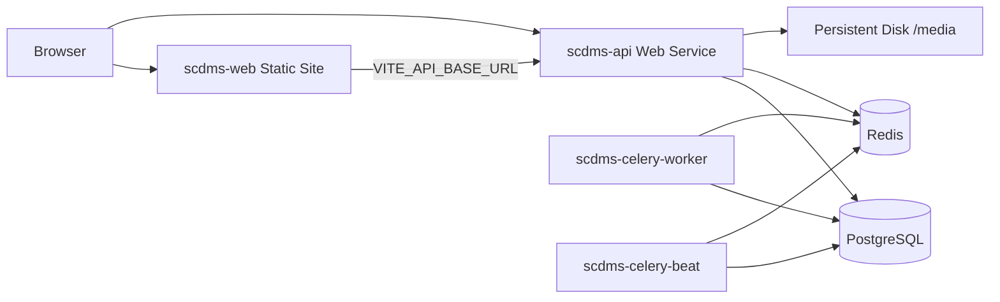

# Deploying on Render.com

This guide deploys the Commission Decision App as separate Render services: **PostgreSQL**, **Redis (Key Value)**, **Django API** (Docker + Gunicorn), **Celery worker**, **Celery beat**, and a **static React** frontend.

## Architecture



## Prerequisites

1. [Render](https://render.com) account and a **GitHub** (or GitLab) repo with this project pushed.
2. **Anthropic API key** for AI features (executive brief, staff chatbot).
3. **SMTP** credentials for password-reset and notification email (or use a provider such as SendGrid, Mailgun, Resend).

## Quick deploy (Blueprint)

1. In Render: **New → Blueprint**.
2. Connect the repository and select **`render.yaml`** at the repo root.
3. When prompted, fill **sync: false** variables (see table below).
4. Click **Apply**. First deploy may take 10–15 minutes.

After deploy, note the public URLs:

| Service       | Example URL                              |
|---------------|------------------------------------------|
| API           | `https://scdms-api.onrender.com`         |
| Frontend      | `https://scdms-web.onrender.com`         |

## Required environment variables

Set these on **`scdms-api`** (and ensure **`scdms-web`** has the frontend URL).

| Variable | Service | Example |
|----------|---------|---------|
| `DJANGO_ALLOWED_HOSTS` | scdms-api | `scdms-api.onrender.com` |
| `CORS_ALLOWED_ORIGINS` | scdms-api | `https://scdms-web.onrender.com` |
| `FRONTEND_URL` | scdms-api | `https://scdms-web.onrender.com` |
| `CDP_BASE_URL` | scdms-api | `https://scdms-api.onrender.com` |
| `VITE_API_BASE_URL` | scdms-web | `https://scdms-api.onrender.com/api` |
| `ANTHROPIC_API_KEY` | scdms-api | `sk-ant-...` |
| `SMTP_HOST`, `SMTP_USER`, `SMTP_PASSWORD` | scdms-api | your mail provider |
| `DEFAULT_FROM_EMAIL` | scdms-api | `SCDMS <noreply@yourdomain.com>` |

`DJANGO_SECRET_KEY` is auto-generated by the blueprint. Celery services copy it from the API service.

### Optional

| Variable | Purpose |
|----------|---------|
| `AUTO_SEED=1` | Run `seed_tracker` on API startup (demo data only; turn off after first boot) |
| `GUNICORN_WORKERS` | Default `2` |
| `ENABLE_STAFF_CHATBOT` | `true` / `false` (default on in code) |

After changing **`VITE_API_BASE_URL`**, trigger a **manual redeploy** of `scdms-web` (static sites bake env at build time).

### Static site CSS / MIME errors

If the browser reports `text/plain` for `/assets/*.css`, the SPA catch-all was serving `index.html` for asset URLs (often after a deploy when an old cached `index.html` points at removed hashed files). The blueprint uses an `/assets/*` rewrite **before** `/* → /index.html`, and `frontend/public/_headers` sets cache + MIME headers. After fixing, **Clear site data** or hard-refresh (`Ctrl+Shift+R`) on `scdms-web`, or use the PWA “Update” banner.

### API 403 on submissions

Usually **no PSC profile** for the logged-in user. In Render Shell on `scdms-api`:

```bash
python manage.py shell -c "
from django.contrib.auth.models import User
from tracker.models import Profile, Role
u = User.objects.get(username='THEIR_USERNAME')
Profile.objects.get_or_create(user=u, defaults={'role': Role.PSC_SECRETARY})
print('OK', u.username, u.psc_profile.role)
"
```

Redeploy **`scdms-api`** so `profile_utils.ensure_psc_profile` runs (staff/superuser auto-get PSC Admin). Non-staff users must have a profile row.

## Verify deployment

1. **Health**: open `https://<api-host>/health/` — `database` and `redis` should be `true`.
2. **API root**: `https://<api-host>/` returns JSON service info.
3. **Frontend**: open the static site URL, log in (create superuser below if needed).
4. **Celery**: in Render logs for `scdms-celery-worker`, confirm the worker starts without import errors.

## Seed demo data on Render

Use this after the first successful deploy (migrations must have run on `scdms-api`).

### Option A — Environment variable (easiest)

1. Open **`scdms-api`** → **Environment**.
2. Add or set **`AUTO_SEED`** = `1`.
3. **Manual Deploy** (clear build cache optional).
4. Watch **Logs** for `seed_tracker` / `[OK] Database seeded successfully`.
5. Set **`AUTO_SEED`** back to **`0`** and deploy again (do not leave seeding on every restart in production).

### Option B — Render Shell (recommended for production)

1. Open **`scdms-api`** → **Shell** (requires a paid plan with shell access).
2. Run:

```bash
python manage.py seed_tracker
```

Idempotent: ministries, departments, roles, and users are updated; **submissions are only created if the database has none**. To wipe and re-seed submissions:

```bash
python manage.py seed_tracker --clear
```

Reference data only (no demo submissions):

```bash
python manage.py seed_tracker --no-submissions
```

### Demo logins (after `seed_tracker`)

| Username | Password | Role |
|----------|----------|------|
| `admin` | `Admin1234!` | PSC Admin |
| `j.iati` | `Secretary123!` | PSC Secretary |
| `hr.finance` | `Ministry123!` | Ministry HR (MFEM) |
| `hr.health` | `Ministry123!` | Ministry HR (MOH) |
| `dg.mfem` | `DG12345!` | Head of Agency (MFEM) |

Change these passwords after any public demo. For a custom admin instead of seed users:

```bash
python manage.py createsuperuser
```

## Files added for Render

| File | Role |
|------|------|
| `render.yaml` | Blueprint (DB, Redis, API, workers, static site) |
| `backend/Dockerfile.render` | Production API image |
| `backend/docker-entrypoint-render.sh` | migrate, collectstatic, Gunicorn |
| `backend/config/settings.py` | `DATABASE_URL`, proxy SSL, WhiteNoise, `CDP_BASE_URL` media URLs |

Local Docker Compose is unchanged; use `docker compose` for development.

## Media uploads

Uploaded files are stored on a **10 GB persistent disk** mounted at `/var/scdms/media` on the API service (`SERVE_MEDIA=true`). Render disks are **not** attachable to multiple services, so Celery workers fetch file bytes from the API over the private network (`http://scdms-api:10000/internal/media/...`) using a shared **`INTERNAL_MEDIA_TOKEN`** (auto-generated in `render.yaml` for new blueprints).

If you deployed before this fix, add **`INTERNAL_MEDIA_TOKEN`** (same random value on **scdms-api** and **scdms-celery-worker**), redeploy both, then re-run **Extract text & facts** on the document.

## Custom domain

1. Add custom domain on **scdms-web** and **scdms-api** in Render.
2. Update `DJANGO_ALLOWED_HOSTS`, `CORS_ALLOWED_ORIGINS`, `FRONTEND_URL`, `CDP_BASE_URL`, and rebuild **scdms-web** with updated `VITE_API_BASE_URL`.

## Costs and limits

- **Starter** plans avoid cold starts on the API; free tiers spin down after inactivity.
- PostgreSQL and Redis have separate monthly pricing on Render.
- Three Docker services (API + 2 workers) plus DB, Redis, and static site — budget accordingly.

## Troubleshooting

| Symptom | Check |
|---------|--------|
| `lstat .../backend/backend: no such file or directory` | **Wrong Docker paths.** With Root Directory `backend`, use Dockerfile `./Dockerfile.render` only — not `./backend/Dockerfile.render`. |
| `frontend/src/i18n/locales: not found` | Build context is `backend/` only; use `backend/Dockerfile.render` (bundled `locale_bundles/`) or repo-root `./Dockerfile.render` + empty Root Directory. |
| `open Dockerfile: no such file or directory` | Use repo root + `./backend/Dockerfile.render`, or root `Dockerfile` at repo root |
| `NameError: MinuteAgendaIntake is not defined` | Deploy latest `main` (import fix in `serializers.py`); redeploy API + Celery after pull |
| Frontend build: `TaskListRegular` not exported | Deploy latest `main` (`CommissionCalendar.jsx` uses `TaskListLtrRegular`) |
| `/secretariat/minute-intake` → app 404 | `scdms-web` deploy failed or old bundle — fix web build, redeploy static site |
| 502 on API | Deploy logs; `migrate` errors; invalid `DATABASE_URL` |
| CORS errors in browser | `CORS_ALLOWED_ORIGINS` must exactly match frontend origin (scheme + host, no trailing slash) |
| Login works locally on Render but API 400 | `DJANGO_ALLOWED_HOSTS` must include API hostname |
| Brief stuck on “Generating…” | `scdms-celery-worker` running; `ANTHROPIC_API_KEY` set; worker logs |
| `scdms-celery-worker` failed | Open **Logs** — often OOM; blueprint uses `--pool=solo`. Redeploy after pull. Ensure worker has same `DATABASE_URL` / Redis env as API |
| Broken images / uploads | `CDP_BASE_URL` set to public API URL; disk mounted on API |
| OCR / extract: **File not found on disk** | `INTERNAL_MEDIA_TOKEN` on **api** and **worker** (same value); redeploy worker after API; check worker logs for `MEDIA_FETCH_FAIL` |
| Admin has no CSS | `collectstatic` in deploy logs; `USE_WHITENOISE=true` |

## Manual deploy (without Blueprint)

You can create each service by hand using the same settings as `render.yaml`:

- **Web (Docker)**: context `backend`, Dockerfile `Dockerfile.render`, health `/health/`, disk at `/var/scdms/media`.
- **Worker**: same image, command `celery -A config worker -l info`.
- **Worker**: command `celery -A config beat -l info --scheduler django_celery_beat.schedulers:DatabaseScheduler`.
- **Static site**: root `frontend`, build `npm ci && npm run build`, publish `dist`, SPA rewrite to `/index.html`.

Link `DATABASE_URL` and Redis connection strings from managed instances in the Render dashboard.

### Docker settings per service (if not using Blueprint)

For **scdms-api**, **scdms-celery-worker**, and **scdms-celery-beat** (must match `render.yaml`):

| Setting | Value |
|---------|--------|
| Environment | Docker |
| **Root Directory** | *(leave empty — repository root)* |
| **Dockerfile Path** | `./Dockerfile.render` |
| **Docker Build Context** | `.` |
| **Docker Command** | *(empty — uses image entrypoint)* |

**If Root Directory = `backend`** (alternate manual setup):

| **Dockerfile Path** | `./Dockerfile.render` |
| **Docker Build Context** | `.` |

Uses `backend/Dockerfile.render`, which copies `locale_bundles/` from inside `backend/` (run `scripts/sync-locale-bundles.sh` after editing frontend translations).

Do **not** use `./backend/Dockerfile.render` as the path when Root Directory is already `backend` (that resolves to `backend/backend/...`).

Blueprint `render.yaml` uses repo-root `./Dockerfile.render` + context `.`.
