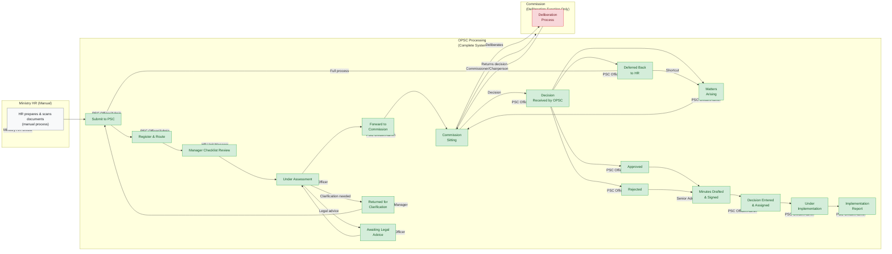

```mermaid
flowchart LR
    %% === MINISTRY HR (MANUAL PREPARATION) ===
    subgraph MinistryHR["Ministry HR (Manual)"]
        HR_Prepare["HR prepares & scans documents<br/>(manual process)"]
    end
    
    %% === OPSC PROCESSING (END-TO-END SYSTEM) ===
    subgraph OPSC["OPSC Processing<br/>(Complete System Workflow)"]
        SUB["Submit to PSC"] --> REG["Register & Route"]
        REG --> MCR["Manager Checklist Review"]
        MCR --> UA["Under Assessment"]
        
        %% Assessment handling
        UA -->|Clarification needed| RFC["Returned for<br>Clarification"]
        RFC --> SUB
        UA -->|Legal advice| ALA["Awaiting Legal<br>Advice"]
        ALA --> UA
        
        %% Commission interaction (OPSC manages this)
        UA --> FWD["Forward to<br>Commission"]
        FWD --> CS["Commission<br>Sitting"]
        
        %% Commission returns decision to OPSC
        CS -->|Decision| DECISION["Decision<br>Received by OPSC"]
        
        %% Decision processing
        DECISION --> APP["Approved"]
        DECISION --> REJ["Rejected"]
        DECISION --> MA["Matters<br>Arising"]
        DECISION --> DHR["Deferred Back<br>to HR"]
        
        %% Deferral handling (OPSC managed)
        DHR -->|Full process| SUB
        DHR -->|Shortcut| MA
        MA --> CS
        
        %% Post-decision processing (OPSC handled)
        APP --> MDS["Minutes Drafted<br>& Signed"]
        REJ --> MDS
        MDS --> DEA["Decision Entered<br>& Assigned"]
        DEA --> UI["Under<br>Implementation"]
        UI --> IR["Implementation<br>Report"]
    end
    
    %% === COMMISSION (DELIBERATION ONLY) ===
    subgraph Commission["Commission<br/>(Deliberation Function Only)"]
        CS -->|Deliberates| DELIB[Deliberation<br>Process]
        DELIB -->|Returns decision| CS
    end
    
    %% === CONNECTIONS ===
    %% Manual HR feeds into system
    HR_Prepare --> SUB
    
    %% === ROLE ASSIGNMENTS (text labels) ===
    %% Ministry HR Roles
    HR_Prepare -->|Ministry HR Officer| MinistryHR
    
    %% OPSC Roles
    SUB -->|PSC Officer/Admin| OPSC
    REG -->|PSC Officer/Admin| OPSC
    MCR -->|HR Unit Manager| OPSC
    UA -->|PSC Officer| OPSC
    RFC -->|HR Unit Manager| OPSC
    ALA -->|PSC Officer| OPSC
    FWD -->|PSC Officer/Admin| OPSC
    DECISION -->|PSC Officer/Admin| OPSC
    APP -->|PSC Officer/Admin| OPSC
    REJ -->|PSC Officer/Admin| OPSC
    MA -->|PSC Officer/Admin| OPSC
    DHR -->|PSC Officer/Admin| OPSC
    MDS -->|Senior Admin Officer| OPSC
    DEA -->|PSC Officer/Admin| OPSC
    UI -->|PSC Officer/Admin| OPSC
    IR -->|PSC Officer/Admin| OPSC
    
    %% Commission Roles
    CS -->|Commissioner/Chairperson| Commission
    
    %% === STYLING ===
    classDef ministryHR fill:#f8f9fa,stroke:#6c757d,color:#212529;
    classDef opsc fill:#d4edda,stroke:#28a745,color:#155724;
    classDef commission fill:#f8d7da,stroke:#dc3545,color:#721c24;
    
    class HR_Prepare ministryHR;
    class SUB,REG,MCR,UA,RFC,ALA,FWD,CS,DECISION,APP,REJ,MA,DHR,MDS,DEA,UI,IR opsc;
    class DELIB commission;
```