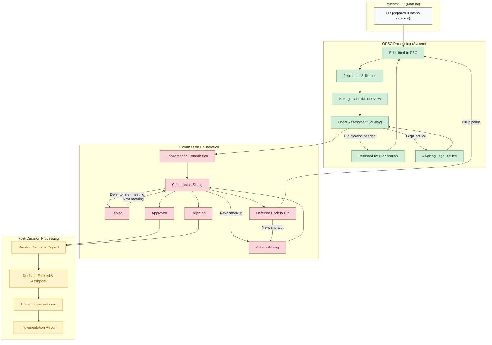

```mermaid
flowchart TB
    %% Ministry HR (Manual steps)
    subgraph MinistryHR["Ministry HR (Manual)"]
        direction TB
        HR_Prepare["HR prepares & scans (manual)"]
    end
    
    %% OPSC Processing (System starts here)
    subgraph OPSC_Processing["OPSC Processing (System)"]
        direction TB
        SUB["Submitted to PSC"] --> REG["Registered & Routed"]
        REG --> MCR["Manager Checklist Review"]
        MCR --> UA["Under Assessment (21‑day)"]
        UA -->|"Clarification needed"| RFC["Returned for Clarification"]
        RFC --> SUB
        UA -->|"Legal advice"| ALA["Awaiting Legal Advice"]
        ALA --> UA
    end
    
    %% Commission Deliberation
    subgraph Commission_Deliberation["Commission Deliberation"]
        direction TB
        UA --> FTC["Forwarded to Commission"]
        FTC --> CS["Commission Sitting"]
        CS -->|"Defer to later meeting"| TAB["Tabled"]
        TAB -->|"Next meeting"| CS
        CS --> APP["Approved"]
        CS --> REJ["Rejected"]
        CS -->|"New: shortcut"| MA["Matters Arising"]
        CS --> DHR["Deferred Back to HR"]
        DHR -->|"Full pipeline"| SUB
        DHR -->|"New: shortcut"| MA
        MA --> CS
    end
    
    %% Post-Decision Processing
    subgraph Post_Decision_Processing["Post-Decision Processing"]
        direction TB
        APP --> MDS["Minutes Drafted & Signed"]
        REJ --> MDS
        MDS --> DEA["Decision Entered & Assigned"]
        DEA --> UI["Under Implementation"]
        UI --> IR["Implementation Report"]
    end
    
    %% Connect manual HR to system start
    HR_Prepare --> SUB
    
    %% Styling for clarity
    classDef ministryHR fill:#f8f9fa,stroke:#6c757d,color:#212529;
    classDef opsc fill:#d4edda,stroke:#28a745,color:#155724;
    classDef commission fill:#f8d7da,stroke:#dc3545,color:#721c24;
    classDef postDecision fill:#fff3cd,stroke:#ffc107,color:#856404;
    
    %% Apply styling
    class HR_Prepare ministryHR;
    class SUB,REG,MCR,UA,RFC,ALA opsc;
    class FTC,CS,TAB,APP,REJ,MA,DHR commission;
    class MDS,DEA,UI,IR postDecision;
```