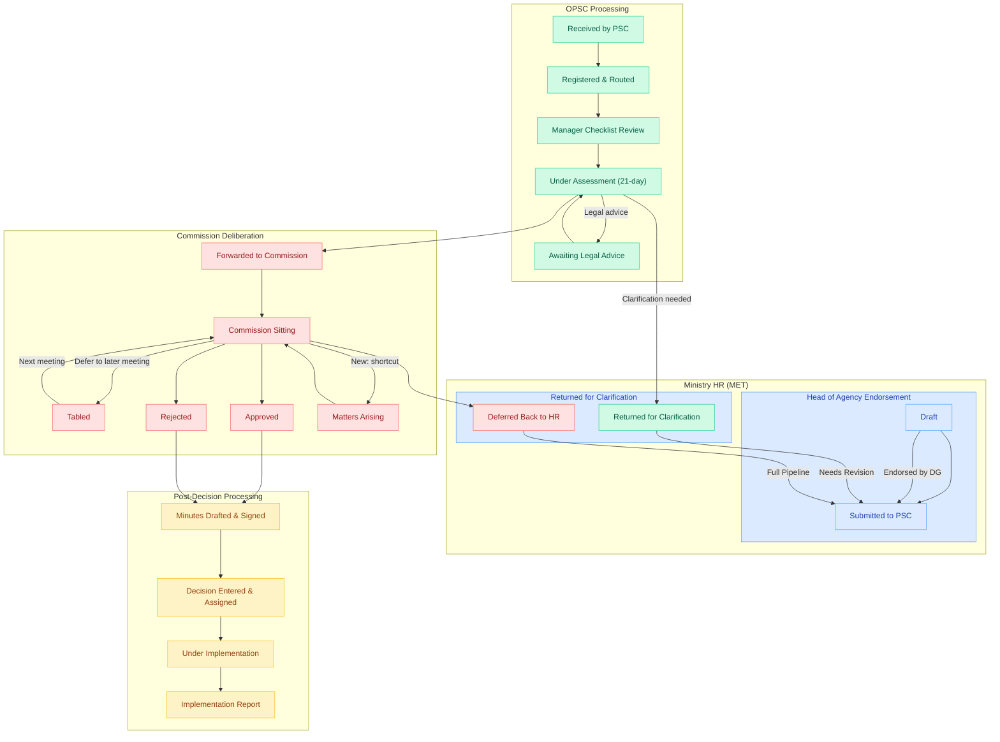

```mermaid
flowchart TB
    %% Define subgraphs with clear group labels
    subgraph MinistryHR["Ministry HR (MET)"]
        direction TB
        DRAFT["Draft"] --> SUB["Submitted to PSC"]
        subgraph HR_Endorsement["Head of Agency Endorsement"]
            DRAFT -->|Endorsed by DG| SUB
        end
        subgraph HR_Return["Returned for Clarification"]
            RFC["Returned for Clarification"] -->|Needs Revision| SUB
            DHR["Deferred Back to HR"] -->|Full Pipeline| SUB
        end
    end
    
    subgraph OPSC_Processing["OPSC Processing"]
        direction TB
        REC["Received by PSC"] --> REG["Registered & Routed"]
        REG --> MCR["Manager Checklist Review"]
        MCR --> UA["Under Assessment (21‑day)"]
        UA -->|"Clarification needed"| RFC
        UA -->|"Legal advice"| ALA["Awaiting Legal Advice"]
        ALA --> UA
    end
    
    subgraph Commission_Deliberation["Commission Deliberation"]
        direction TB
        UA --> FTC["Forwarded to Commission"]
        FTC --> CS["Commission Sitting"]
        CS -->|"Defer to later meeting"| TAB["Tabled"]
        TAB -->|"Next meeting"| CS
        CS --> APP["Approved"]
        CS --> REJ["Rejected"]
        CS -->|"New: shortcut"| MA["Matters Arising"]
        CS --> DHR
        MA --> CS
    end
    
    subgraph Post_Decision_Processing["Post-Decision Processing"]
        direction TB
        APP --> MDS["Minutes Drafted & Signed"]
        REJ --> MDS
        MDS --> DEA["Decision Entered & Assigned"]
        DEA --> UI["Under Implementation"]
        UI --> IR["Implementation Report"]
    end
    
    %% Styling for clarity
    classDef ministryHR fill:#dbeafe,stroke:#60a5fa,color:#1e40af;
    classDef opsc fill:#d1fae5,stroke:#34d399,color:#065f46;
    classDef commission fill:#fee2e2,stroke:#f87171,color:#991b1b;
    classDef postDecision fill:#fef3c7,stroke:#fbbf24,color:#92400e;
    
    %% Apply styling
    class DRAFT,SUB,HR_Endorsement,HR_Return ministryHR;
    class REC,REG,MCR,UA,RFC,ALA opsc;
    class FTC,CS,TAB,APP,REJ,MA,DHR commission;
    class MDS,DEA,UI,IR postDecision;
```