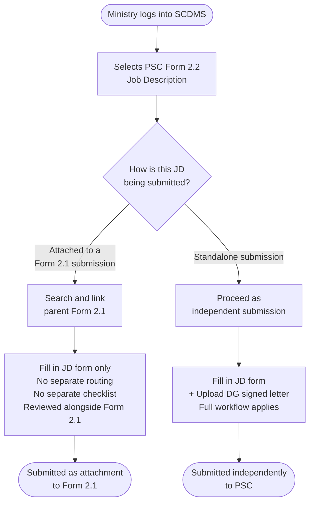
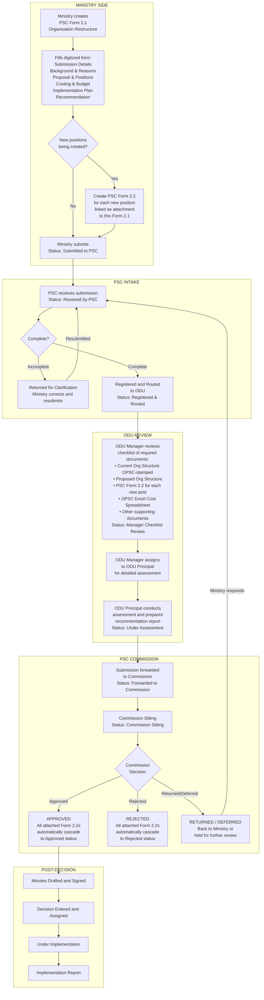
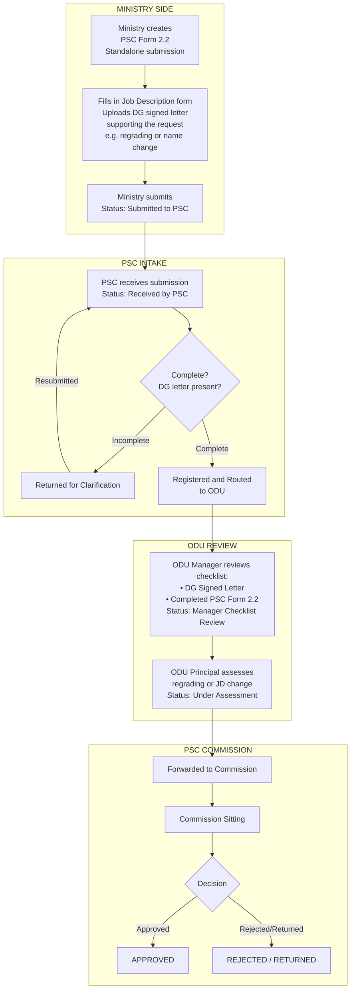
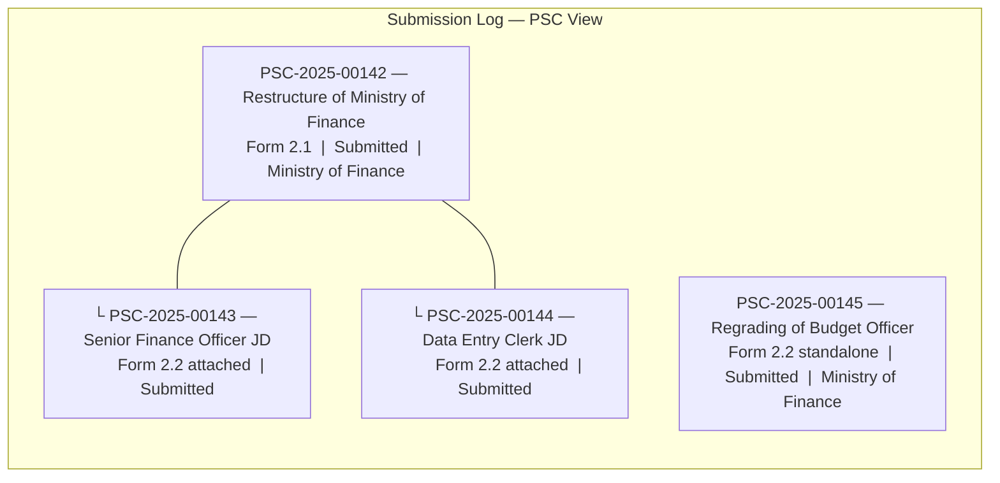

# PSC Form 2.1 & 2.2 — Submission Workflow
*For review by the Organisational Development Unit (ODU)*

---

## Diagram 1 — How PSC Form 2.2 is Submitted (Two Paths)

---

## Diagram 2 — Full Workflow: PSC Form 2.1 with Attached Form 2.2

---

## Diagram 3 — Standalone PSC Form 2.2 Workflow
*(e.g. Regrading, Position Name Change — submitted without a Form 2.1)*

---

## Diagram 4 — How Form 2.2 Attachments Appear in the System
*(What the PSC sees in the Submission Log)*

---

## Summary Table — ODU Involvement by Submission Type

| | PSC Form 2.1 | Form 2.2 Attached to 2.1 | Form 2.2 Standalone |
|---|---|---|---|
| **Separate routing to ODU** | Yes | No — reviewed with parent 2.1 | Yes |
| **Separate checklist review** | Yes | No | Yes |
| **DG letter required** | No | No | Yes |
| **ODU assessment report** | Yes | Covered by 2.1 report | Yes |
| **Commission decision** | Yes | Auto-cascades from 2.1 | Yes |
| **Appears in log as top-level** | Yes | No — indented under 2.1 | Yes |

---

*Diagram prepared by IPDU · SCDMS System · May 2026*
