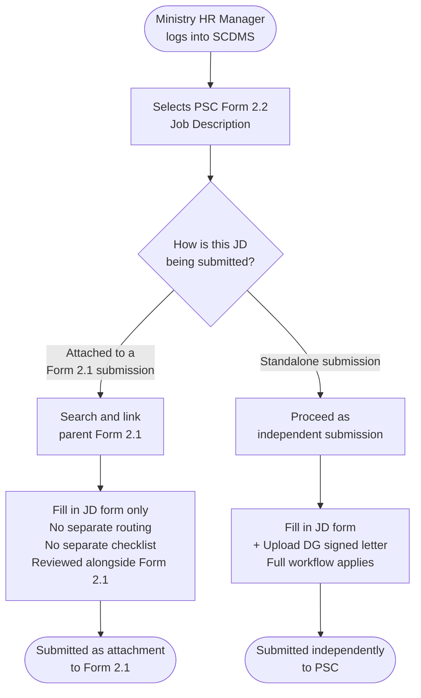
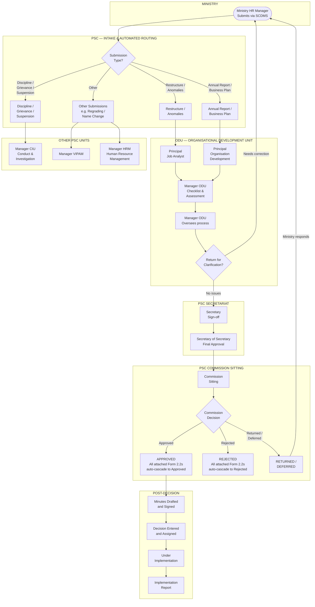
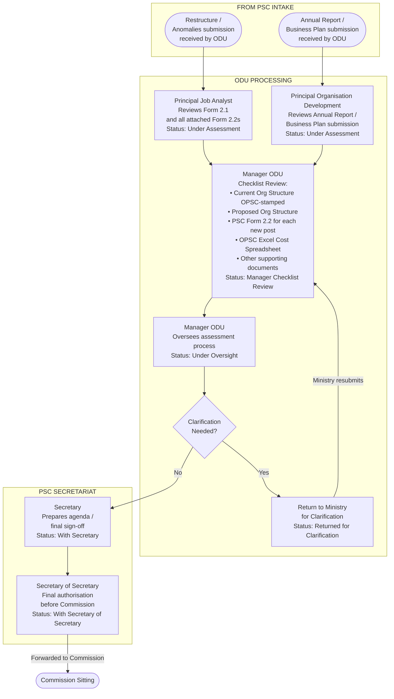
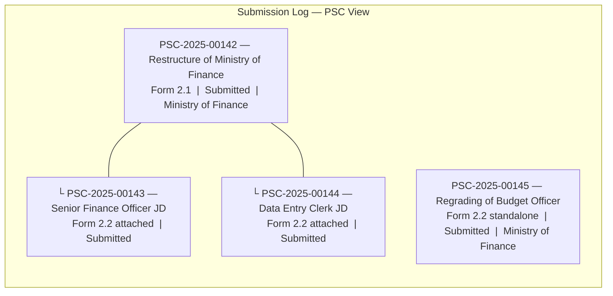

---
output:
  word_document: default
  html_document: default
---
# PSC Form 2.1 & 2.2 — Submission Workflow
*For review by the Organisational Development Unit (ODU)*

---

## Diagram 1 — How PSC Form 2.2 is Submitted (Two Paths)

---

## Diagram 2 — Full PSC Internal Workflow

---

## Diagram 3 — Detailed ODU Internal Routing

---

## Diagram 4 — How Form 2.2 Attachments Appear in the System
*(What the PSC sees in the Submission Log)*

---

## Summary Table — ODU Involvement by Submission Type

| | PSC Form 2.1 (Restructure) | Form 2.2 Attached to 2.1 | Form 2.2 Standalone |
|---|---|---|---|
| **Automated routing to** | Principal Job Analyst → Manager ODU | No — reviewed with parent 2.1 | Manager ODU directly |
| **Separate checklist review** | Yes — Manager ODU | No | Yes — Manager ODU |
| **DG letter required** | No | No | Yes |
| **ODU assessment report** | Yes — Principal Job Analyst | Covered by 2.1 report | Yes |
| **Commission decision** | Yes | Auto-cascades from 2.1 | Yes |
| **Appears in log as top-level** | Yes | No — indented under 2.1 | Yes |
| **Return for clarification** | Manager ODU → Ministry HR Manager | Via parent 2.1 | Manager ODU → Ministry HR Manager |

---

## Routing Decision Table — By Submission Type

| Submission Type | Routed To |
|---|---|
| Restructure / Anomalies | Principal Job Analyst → Manager ODU |
| Annual Report / Business Plan | Principal Organisation Development → Manager ODU |
| Discipline / Grievance / Suspension | Manager CIU |
| Regrading / Name Change / Other | Manager VIPAM / Manager HRM |

---

*Diagram prepared by IPDU · SCDMS System · May 2026*
