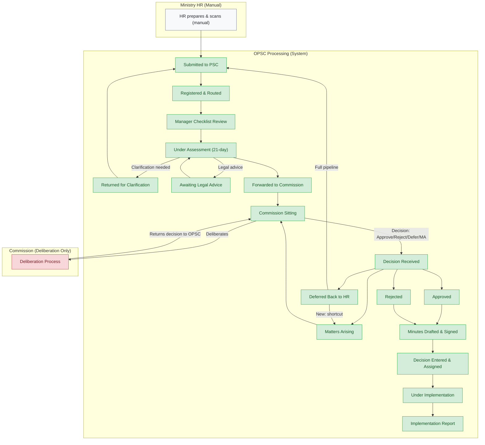

```mermaid
flowchart TB
    %% Ministry HR (Manual steps only)
    subgraph MinistryHR["Ministry HR (Manual)"]
        direction TB
        HR_Prepare["HR prepares & scans (manual)"]
    end
    
    %% OPSC Processing (System handles the workflow)
    subgraph OPSC_Processing["OPSC Processing (System)"]
        direction TB
        %% Submission and initial processing
        SUB["Submitted to PSC"] --> REG["Registered & Routed"]
        REG --> MCR["Manager Checklist Review"]
        MCR --> UA["Under Assessment (21‑day)"]
        
        %% Assessment loops
        UA -->|"Clarification needed"| RFC["Returned for Clarification"]
        RFC --> SUB
        UA -->|"Legal advice"| ALA["Awaiting Legal Advice"]
        ALA --> UA
        
        %% Forward to Commission (OPSC still manages the process)
        UA --> FTC["Forwarded to Commission"]
        FTC --> CS["Commission Sitting"]
        
        %% Commission sends decision back to OPSC
        CS -->|"Decision: Approve/Reject/Defer/MA"| Decision["Decision Received"]
        Decision --> APP["Approved"]
        Decision --> REJ["Rejected"]
        Decision --> MA["Matters Arising"]
        Decision --> DHR["Deferred Back to HR"]
        
        %% OPSC handles deferrals
        DHR -->|"Full pipeline"| SUB
        DHR -->|"New: shortcut"| MA
        MA --> CS
        
        %% OPSC handles post-decision
        APP --> MDS["Minutes Drafted & Signed"]
        REJ --> MDS
        MDS --> DEA["Decision Entered & Assigned"]
        DEA --> UI["Under Implementation"]
        UI --> IR["Implementation Report"]
    end
    
    %% Commission (Only deliberates and makes decisions)
    subgraph Commission["Commission (Deliberation Only)"]
        direction TB
        CS["Commission Sitting"] -->|"Deliberates"| Deliberation[Deliberation Process]
        Deliberation -->|"Returns decision to OPSC"| CS
    end
    
    %% Connect manual HR to system start
    HR_Prepare --> SUB
    
    %% Styling for clarity
    classDef ministryHR fill:#f8f9fa,stroke:#6c757d,color:#212529;
    classDef opsc fill:#d4edda,stroke:#28a745,color:#155724;
    classDef commission fill:#f8d7da,stroke:#dc3545,color:#721c24;
    
    %% Apply styling
    class HR_Prepare ministryHR;
    class SUB,REG,MCR,UA,RFC,ALA,FTC,CS,Decision,APP,REJ,MA,DHR,MDS,DEA,UI,IR opsc;
    class Deliberation commission;
```