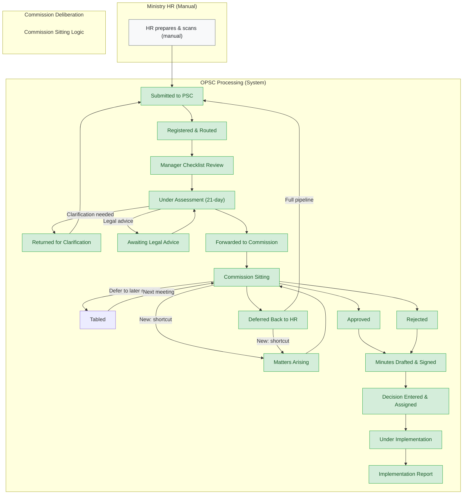

```mermaid
flowchart TB
    %% Ministry HR (Manual steps)
    subgraph MinistryHR["Ministry HR (Manual)"]
        direction TB
        HR_Prepare["HR prepares & scans (manual)"]
    end
    
    %% OPSC Processing (System starts here and includes post-decision)
    subgraph OPSC_Processing["OPSC Processing (System)"]
        direction TB
        SUB["Submitted to PSC"] --> REG["Registered & Routed"]
        REG --> MCR["Manager Checklist Review"]
        MCR --> UA["Under Assessment (21‑day)"]
        UA -->|"Clarification needed"| RFC["Returned for Clarification"]
        RFC --> SUB
        UA -->|"Legal advice"| ALA["Awaiting Legal Advice"]
        ALA --> UA
        
        %% Post-decision processing (still part of OPSC)
        UA --> FTC["Forwarded to Commission"]
        FTC --> CS["Commission Sitting"]
        CS -->|"Defer to later meeting"| TAB["Tabled"]
        TAB -->|"Next meeting"| CS
        CS --> APP["Approved"]
        CS --> REJ["Rejected"]
        CS -->|"New: shortcut"| MA["Matters Arising"]
        CS --> DHR["Deferred Back to HR"]
        DHR -->|"Full pipeline"| SUB
        DHR -->|"New: shortcut"| MA
        MA --> CS
        APP --> MDS["Minutes Drafted & Signed"]
        REJ --> MDS
        MDS --> DEA["Decision Entered & Assigned"]
        DEA --> UI["Under Implementation"]
        UI --> IR["Implementation Report"]
    end
    
    %% Commission Deliberation
    subgraph Commission_Deliberation["Commission Deliberation"]
        direction TB
        %% Note: Commission steps are actually within OPSC_Processing above
        %% This subgraph is now just for visual grouping of the commission sitting logic
        %% but the actual flow remains in OPSC_Processing
        %% We'll keep it as a visual aid but make it clear it's part of OPSC workflow
        dummy["Commission Sitting Logic"]:::invisible
    end
    
    %% Connect manual HR to system start
    HR_Prepare --> SUB
    
    %% Styling for clarity
    classDef ministryHR fill:#f8f9fa,stroke:#6c757d,color:#212529;
    classDef opsc fill:#d4edda,stroke:#28a745,color:#155724;
    classDef commission fill:#f8d7da,stroke:#dc3545,color:#721c24;
    classDef invisible fill:#00000000,stroke:#00000000;
    
    %% Apply styling
    class HR_Prepare ministryHR;
    class SUB,REG,MCR,UA,RFC,ALA,FTC,CS,APP,REJ,MA,DHR,MDS,DEA,UI,IR opsc;
    class dummy invisible;
```